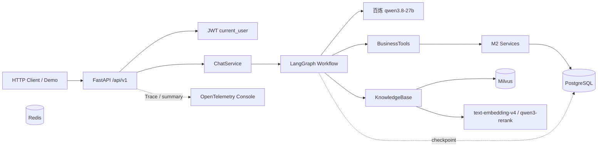
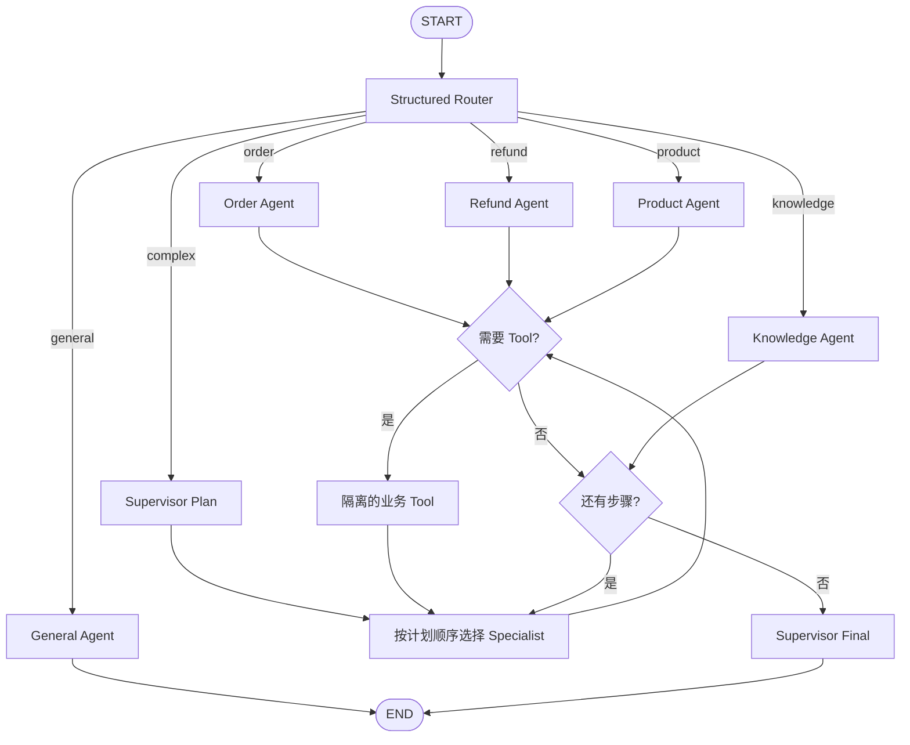
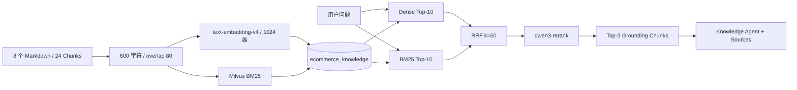
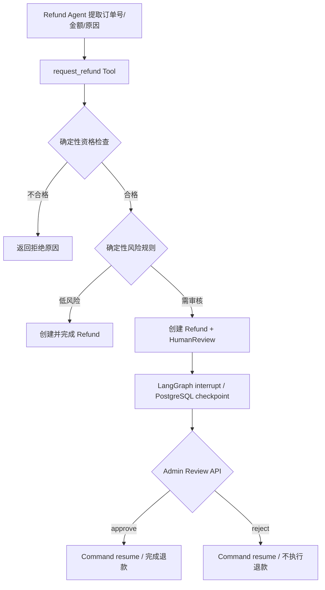

# ecommerce-ai-agent

一个从第一性原理逐步构建的电商 Multi-Agent 智能客服学习项目。当前已完成 M0～M15：真实模型、业务 Tool、LangGraph 编排、混合 RAG、多轮持久化、退款 Human-in-the-loop、JWT、Agent Evaluation 和最小 Observability 均已形成可运行闭环。

## 系统能力

- FastAPI `/api/v1`、统一错误响应、OpenAPI 与健康检查
- PostgreSQL 业务模型、SQLAlchemy Async、Alembic 与幂等 Seed
- 阿里云百炼 OpenAI-compatible API：`qwen3.8-27b`
- LangGraph Router、Supervisor、Order/Refund/Product/Knowledge Specialist
- 四个业务 Tool：订单、商品、退款查询与退款申请
- Milvus Dense + BM25 + RRF + `qwen3-rerank`
- PostgreSQL `AsyncPostgresSaver` 多轮会话状态
- 确定性退款资格/风控、`interrupt/resume` 人工审核
- HS256 JWT、customer/admin 最小角色边界
- 20 条 Agent Evaluation 与 12 条 Retrieval Evaluation
- OpenTelemetry 手动 Trace、路径、Latency、Token、调用次数、Error 与成本估算

项目刻意不包含 Kubernetes、微服务、OAuth、Refresh Token、复杂 RBAC、消息队列、长期记忆、生产监控平台或支付网关。

## 系统架构



Redis 保留为基础设施学习组件，当前不承载 Conversation Memory。

## Multi-Agent Workflow



Tool Isolation：Order 只能查订单；Product 只能查 SKU；Refund 只能查退款或申请退款；Knowledge 不持有业务 Tool。

## RAG 流程



## 退款 Human-in-the-loop



LLM 不决定退款资格、金额、风险或审批结果；这些均由 Python 规则与数据库约束执行。

## 环境要求

- Python 3.12 或 3.13
- [uv](https://docs.astral.sh/uv/)
- Docker Desktop 或 Docker Engine
- Docker Compose v2+
- Docker 建议分配至少 6 GB 内存

## 配置

```powershell
Copy-Item .env.example .env
```

Linux/macOS：

```bash
cp .env.example .env
```

至少替换本地 PostgreSQL、MinIO、JWT 密码，并配置真实百炼信息：

```text
DASHSCOPE_API_KEY=
BAILIAN_BASE_URL=https://dashscope.aliyuncs.com/compatible-mode/v1
LLM_MODEL=qwen3.8-27b
BAILIAN_RERANK_BASE_URL=https://dashscope.aliyuncs.com/compatible-api/v1
```

Base URL 必须匹配 Key 所属地域/业务空间。`.env` 已被 Git 忽略；不要把真实 Key 写入源码、文档或提交记录。

M14 默认成本单价参考[阿里云 `qwen3.8-27b` 华北 2（北京）公开原价](https://help.aliyun.com/zh/model-studio/qwen3-8-27b)，可在价格变化或切换地域时调整：

```text
LLM_INPUT_PRICE_PER_MILLION_CNY=3.00
LLM_OUTPUT_PRICE_PER_MILLION_CNY=12.00
OTEL_CONSOLE_EXPORTER=true
```

## Docker 一键启动

```bash
docker compose up -d --build --wait
docker compose ps
```

API 容器启动时会幂等执行 `alembic upgrade head` 和 SQL Seed，然后启动 Uvicorn。PostgreSQL、Redis、etcd、MinIO、Milvus 使用命名卷；普通 `down/up` 不丢数据。

首次使用 Knowledge Agent 时显式入库（会调用真实 Embedding 并重建学习用 Collection）：

```bash
uv sync --frozen --all-groups
uv run python scripts/ingest_knowledge.py
```

常用状态：

```bash
docker compose logs -f api
docker compose ps
docker compose down
```

彻底清理数据只能显式运行 `docker compose down -v`，该操作不可恢复。

## 最终 Demo

Docker 和知识库准备完成后：

```bash
uv run python scripts/demo.py
```

Demo 使用 Seed 账号，通过真实 HTTP API 顺序展示：

1. 普通对话
2. 订单查询
3. 同 conversation 的指代与跨 Agent 多轮记忆
4. 商品查询
5. 企业政策 Knowledge Agent 与 Source
6. Order + Refund Supervisor 协作
7. Admin 待审核队列

脚本默认只读且不打印 JWT。真实退款写入、interrupt、approve 与 resume 使用固定会话的显式脚本，重复执行受幂等保护：

```bash
uv run python scripts/refund_smoke_test.py
```

开发 Seed 登录信息：

- customer：`alice@example.com / customer-password`
- admin：`admin@example.com / admin-password`

## API

主要端点：

```text
GET  /health/live
GET  /health/ready
POST /api/v1/auth/login
POST /api/v1/chat
GET  /api/v1/reviews/pending
POST /api/v1/reviews/{review_id}/approve
POST /api/v1/reviews/{review_id}/reject
GET  /docs
GET  /openapi.json
```

登录并调用 Chat：

```bash
curl -X POST http://localhost:8000/api/v1/auth/login \
  -H "Content-Type: application/json" \
  -d '{"email":"alice@example.com","password":"customer-password"}'

curl -X POST http://localhost:8000/api/v1/chat \
  -H "Authorization: Bearer <access_token>" \
  -H "Content-Type: application/json" \
  -d '{"message":"我的订单 EC2026080016 现在是什么状态？"}'
```

`conversation_id` 可选；回传相同 UUID 会恢复同一用户的 LangGraph Thread。内部 `thread_id` 为 `{user_id}:{conversation_id}`，不同用户和会话相互隔离。

## Observability

每个请求响应包含：

```text
X-Request-ID: m14-chat-check
traceparent: 00-<trace_id>-<span_id>-01
```

API 日志包含一条请求汇总：

```json
{
  "message": "Request completed",
  "execution_path": "router -> order_agent -> tools -> tool:get_current_user_order -> order_agent",
  "latency_ms": 4334.34,
  "model_calls": 3,
  "tool_calls": 1,
  "input_tokens": 1336,
  "output_tokens": 261,
  "estimated_cost_cny": 0.00714,
  "error_count": 0
}
```

Console Span 展示 HTTP → Workflow Node → Model/Tool 的父子关系。Prompt、用户消息、Tool 参数、JWT、API Key 和 Provider 原始错误不会进入 Span 或汇总日志。

这是本地学习级 Observability：没有后端存储、查询 UI、分位指标、采样、告警或 SLO。

## 数据与持久化

SQL Seed 幂等提供：

- 6 个用户（5 customer + 1 admin）
- 12 个商品
- 24 个订单与订单项
- 12 条物流、5+ 条退款、3+ 条人工审核记录
- 待支付、处理中、运输中、已完成、已取消、退款与审核场景

金额使用 PostgreSQL `NUMERIC(12,2)` 和 Python `Decimal`；业务状态使用 PostgreSQL Named Enum。业务 Schema 由 Alembic 管理；LangGraph Checkpoint 四张表由官方 `AsyncPostgresSaver.setup()` 管理。

## 测试与评估

默认自动化测试不调用百炼：

```bash
uv lock --check
uv run ruff format --check .
uv run ruff check .
uv run pytest -q
uv run alembic check
uv run python scripts/smoke_test.py
```

显式真实测试会消耗模型额度或写开发数据库：

```bash
uv run python scripts/llm_smoke_test.py
uv run python scripts/tool_calling_smoke_test.py
uv run python scripts/conversation_smoke_test.py
uv run python scripts/rag_smoke_test.py
uv run python scripts/refund_smoke_test.py
```

评估：

```bash
uv run python scripts/evaluate_retrieval.py
uv run python scripts/evaluate_agents.py
```

固定结果见：

- [Retrieval Evaluation](evaluation/retrieval_results.md)
- [Agent Evaluation](evaluation/agent_results.md)
- [开发记录](doc/开发记录文档.md)

## 当前限制

- 会话保存完整 State，没有摘要、裁剪、保留期限或删除 API。
- JWT 没有 Refresh Token、OAuth、撤销列表或复杂 RBAC。
- 退款规则是学习用固定阈值，没有真实支付网关、对账或 ML 风控。
- Supervisor 只做顺序执行，没有并行、Replanning 或 Reflection。
- RAG 数据集很小，当前评估满分不代表真实大规模知识库表现。
- Agent Evaluation 只有 20 条单次样本，不代表模型长期稳定性。
- Console Trace 与成本估算只适合本地学习，不是生产监控或财务账单。
