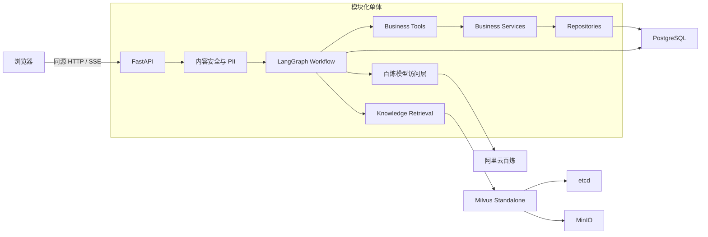
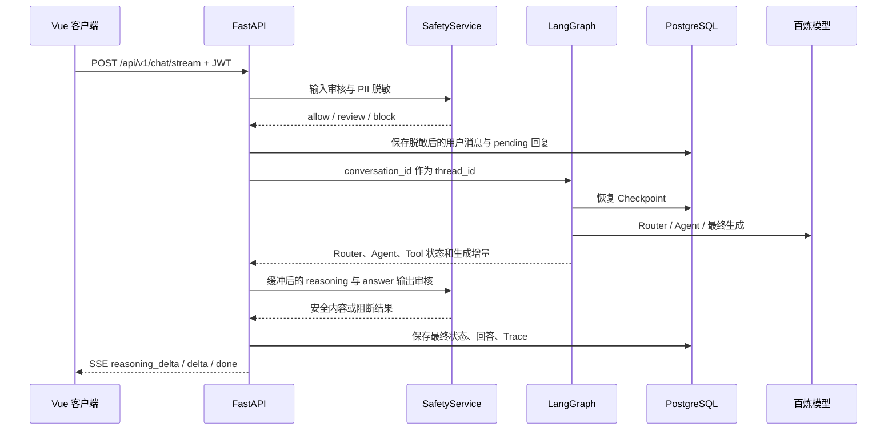
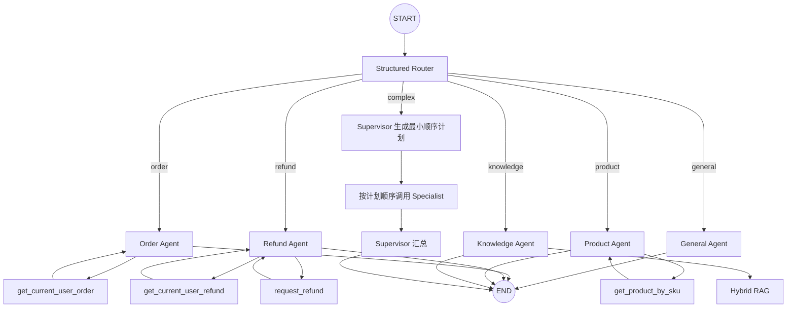
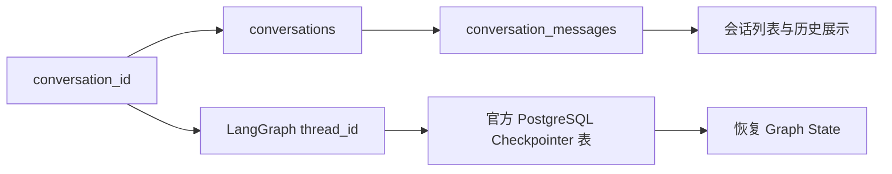
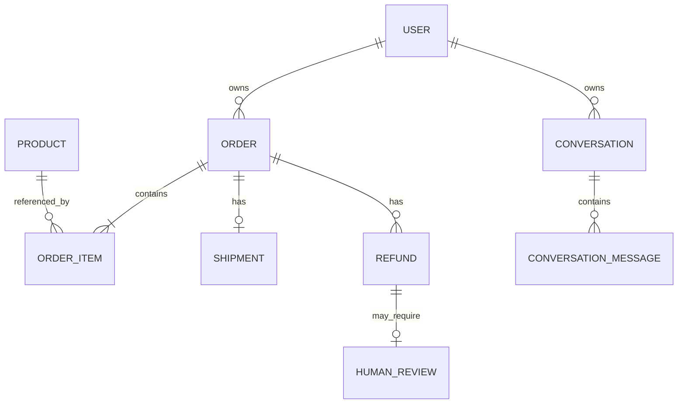
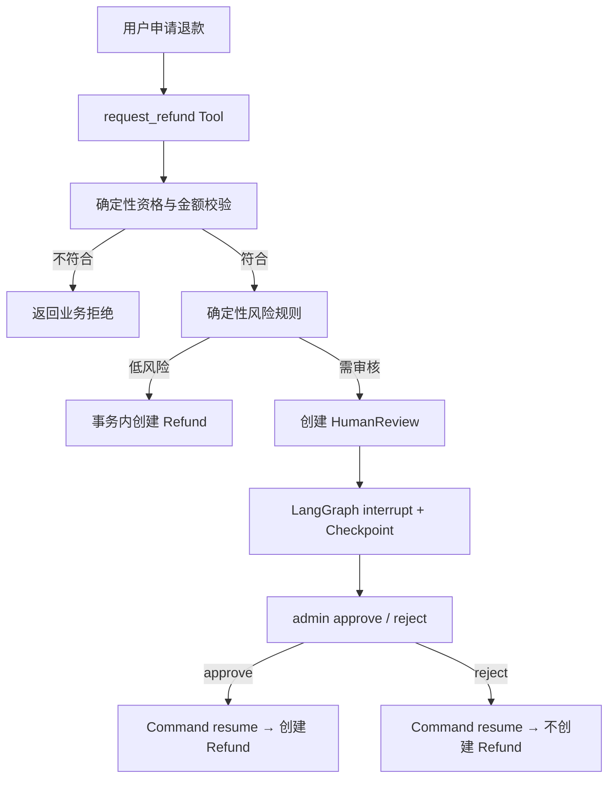
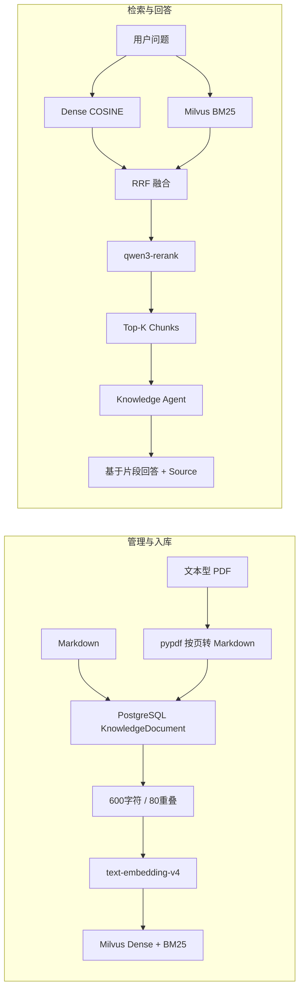
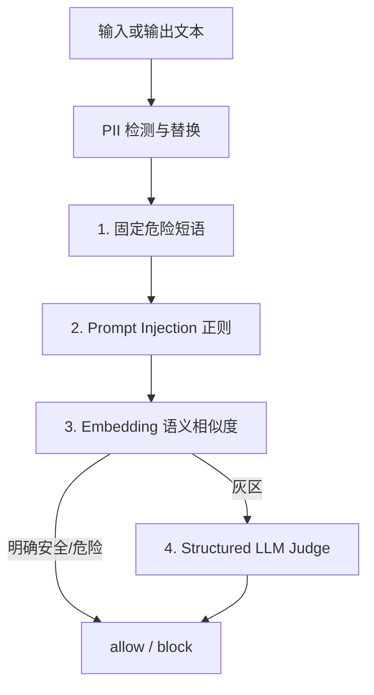
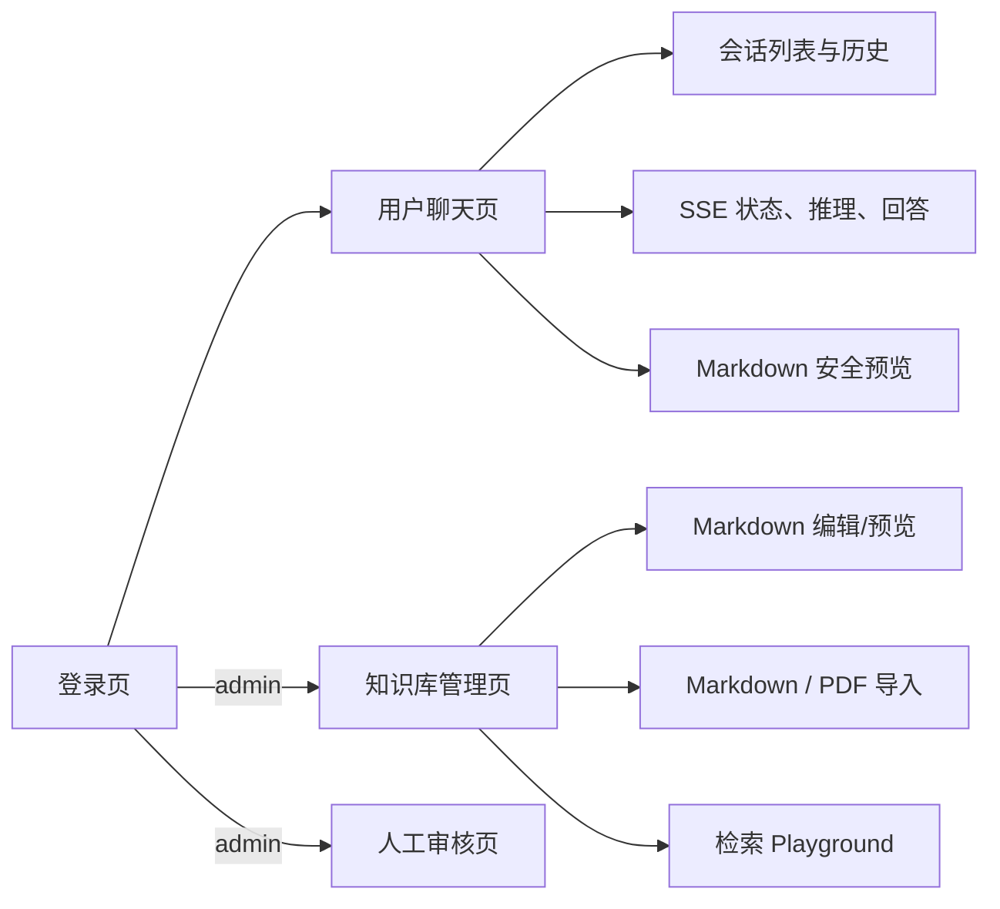

# E-commerce AI Agent 设计方案

> 本文只描述当前仓库已经实现并验证的能力。项目采用模块化单体，目标是用尽量少的抽象完整展示电商 Multi-Agent 的核心链路。

## 1. 系统定位

系统面向电商客服与售后场景，已经形成以下闭环：

- 用户登录、会话列表、历史消息和 SSE 流式交互。
- 订单、商品、退款查询，以及受确定性规则约束的退款申请。
- Router、Specialist Agent、Supervisor 顺序协作和 Tool Calling。
- Markdown/PDF 知识管理、混合检索、重排与基于来源的回答。
- 内容安全审核、PII 脱敏、人工退款审核和 LangGraph 恢复执行。
- 请求 Trace、执行路径、Token、调用次数、耗时与估算成本记录。

## 2. 总体架构



前端使用 Vue 3、TypeScript、Vite 和 `md-editor-v3`。生产构建产物由 FastAPI 同源托管，因此不需要额外前端容器和 CORS 配置。

Docker Compose 当前运行六个服务：API、PostgreSQL、Redis、Milvus、etcd、MinIO。Redis 已完成部署与健康检查，但应用当前没有使用它保存会话或缓存。

## 3. 一次聊天请求如何执行



关键边界：

- JWT 中的用户身份由服务端解析；LLM 不能在 Tool 参数中指定可信 `user_id`。
- 原始 PII 在进入模型、会话数据库和日志前被替换为类型占位符。
- SSE 会实时发送执行状态；模型生成的推理和回答先在服务端完成安全审核，再分块发给浏览器。
- `conversation_id` 同时关联产品会话和 LangGraph `thread_id`，不同用户不能读取彼此会话。
- `client_message_id` 用于避免客户端重试造成同一轮消息重复写入。

## 4. Multi-Agent 工作流



Router 使用 Structured Output，从 `order / refund / product / knowledge / general / complex` 中选择唯一路径。简单请求直接进入 Specialist；只有跨领域请求才进入 Supervisor。

Supervisor 只生成并顺序执行最小计划，不直接拥有业务 Tool。各 Specialist 的 Tool 是静态隔离的：

| Specialist | 可用能力 |
| --- | --- |
| Order Agent | 当前用户订单、订单项与物流查询 |
| Refund Agent | 当前用户退款查询、退款申请 |
| Product Agent | 按 SKU 查询商品 |
| Knowledge Agent | 检索企业政策并附带来源回答 |
| General Agent | 不访问业务数据的普通回答 |

Tool 只调用 M2 Service，不直接访问 ORM 或 Repository。业务链路保持为：

```text
Agent → Tool → Service → Repository → SQLAlchemy → PostgreSQL
```

## 5. 模型与结构化输出

模型访问通过阿里云百炼 OpenAI-compatible API：

| 用途 | 当前模型 |
| --- | --- |
| 文本生成、Tool Calling、Structured Output | `qwen3.8-27b` |
| Dense Embedding | `text-embedding-v4`，1024维 |
| 检索重排 | `qwen3-rerank` |

API Key、Base URL、模型名、超时和有限重试均从环境变量读取。Provider 层把鉴权失败、限流、超时、配置错误和异常响应映射到统一 API Error Contract，不向客户端泄露密钥或 SDK traceback。

Structured Output 当前用于 Router、Supervisor Plan、安全 Judge 等明确 Schema；业务规则不交给模型判断。

## 6. 会话与持久化



职责刻意分开：

- `conversations` 与 `conversation_messages` 是产品层数据，支持最近50个会话、每个会话最近200条消息的展示。
- LangGraph `AsyncPostgresSaver` 管理 Workflow Checkpoint，支持跨 HTTP 请求恢复上下文、暂停和继续。
- 两者共用 PostgreSQL，但不自定义 LangGraph 的 Checkpoint 表结构。

消息状态包括 `pending / completed / pending_review / failed / cancelled`。历史中保存最终回答及供界面折叠展示的 reasoning；历史 reasoning 不重新发送给模型。

## 7. 业务数据与授权



业务实体为 User、Product、Order、OrderItem、Shipment、Refund、HumanReview。金额使用 PostgreSQL `NUMERIC` 和 Python `Decimal`，避免二进制浮点误差；订单、支付、物流、退款、审核、角色均使用受控枚举。

认证使用最小 JWT Bearer 方案，角色为 `customer / admin`：

- customer 只能查询和操作属于自己的订单、退款与会话。
- admin 可进入知识库管理和人工审核接口。
- 跨用户资源对业务查询返回未找到，避免暴露资源是否存在。

## 8. 退款写操作与 Human-in-the-loop



确定性业务逻辑负责：订单存在性、ownership、支付状态、退款期限、剩余可退金额、重复申请保护和风险等级。LLM 只理解意图并提取订单号、金额和原因，不能决定资格、金额、风险或绕过审批。

退款创建与审核记录更新在数据库事务内完成。高风险请求使用 LangGraph 官方 `interrupt / resume` 跨 HTTP 请求暂停与恢复。

## 9. 知识库与 RAG



知识文档以 PostgreSQL 为运行时唯一来源，记录 `content_hash / indexed_hash / indexed_at` 判断是否需要重建。管理员可以创建、编辑、删除 Markdown 文档，也可以上传 PDF。

PDF 导入边界：

- 只接受 PDF 或 octet-stream，并校验 PDF 内容。
- 使用 `pypdf` 提取文本层，按页转换为 Markdown。
- 限制10MB、100页、10万提取字符；拒绝损坏、加密和无可提取文本的文件。
- 提取结果通过内容安全审核后进入与 Markdown 相同的入库链路。

Milvus Collection 为 `ecommerce_knowledge`。重建采用 PostgreSQL 文档 → Chunk → Embedding → Dense/BM25 索引；查询采用 Dense + BM25 + RRF + Reranker，最终只把少量片段交给 Knowledge Agent。没有足够依据时，Agent 明确回答未找到依据。

## 10. 内容安全与 PII



PII 覆盖中国手机号、中国18位身份证校验位、通过 Luhn 校验的银行卡号和 Email，分别替换为 `[PHONE]`、`[ID_CARD]`、`[CREDIT_CARD]`、`[EMAIL]`。

安全日志只记录动作、层级、分类、PII 数量和内容哈希，不记录原文。同步 Chat、SSE Chat、会话历史和知识文档写入均经过相应安全边界。

## 11. 前端界面



JWT 保存在 `sessionStorage`，401 或退出时清除。聊天页支持新会话、历史恢复、停止生成、失败重试、自动滚动、Markdown 回答、来源、Request ID、Trace ID 和等待审核状态；375px 宽度下侧栏切换为抽屉。

Markdown 编辑和预览使用 `md-editor-v3` 并启用 XSSPlugin。管理员页面支持文档管理、索引重建、检索预览以及退款审核 approve/reject。

## 12. API 边界

| 分组 | 主要接口 | 访问者 |
| --- | --- | --- |
| Health | `/health/live`、`/health/ready` | 公共 |
| Auth | `POST /api/v1/auth/login`、`GET /api/v1/auth/me` | 登录/当前用户 |
| Chat | `POST /api/v1/chat`、`POST /api/v1/chat/stream` | customer / admin |
| Conversation | `GET /api/v1/conversations`、`GET /api/v1/conversations/{id}/messages` | owner |
| Knowledge | `/api/v1/knowledge/documents`、`documents/pdf`、`rebuild`、`search` | admin |
| Review | `/api/v1/reviews/pending`、`{id}/approve`、`{id}/reject` | admin |

请求校验使用 Pydantic，非法 JSON、字段错误、业务错误和 Provider 错误统一返回结构化错误，不暴露内部 traceback。

## 13. 可观测性

请求中间件生成或接受 `X-Request-ID`，创建 OpenTelemetry Span，并返回 `traceparent`。当前记录：

- HTTP 方法、路径与状态码。
- Router → Agent → Tool 执行路径。
- 总耗时、模型调用次数、Tool 调用次数。
- 输入/输出 Token、错误类型和按配置单价估算的人民币成本。

Trace 当前通过 OpenTelemetry Console Exporter 输出；日志采用结构化 JSON。这里的目标是让一次请求可解释，而不是建设独立监控平台。

## 14. 部署与工程结构

```text
frontend/                         Vue 3 SPA
src/ecommerce_ai_agent/
├── api/                          HTTP、SSE、认证与管理接口
├── llm/                          百炼模型访问与错误映射
├── models/ repositories/        SQLAlchemy 数据层
├── services/                    业务服务与事务边界
├── workflow.py                  LangGraph 编排
├── business_tools.py            四个业务 Tool
├── knowledge.py                 Ingestion 与混合检索
├── safety.py                    内容安全与 PII
├── pdf_ingestion.py             PDF 文本提取
└── observability.py             Trace 与请求统计
alembic/                          数据库 Migration
knowledge_docs/                   初始 Markdown 文档
tests/                            后端自动化测试
scripts/                          Seed、Smoke 与评估脚本
compose.yaml                      本地一键环境
```

Dockerfile 使用 Node 构建阶段编译 Vue，再在 Python 运行阶段安装 `uv` 锁定的依赖和静态产物。PostgreSQL、Redis、Milvus、etcd、MinIO 均使用命名卷持久化；容器间通过 Compose Service Name 通信。

## 15. 当前实现特征

- Supervisor 使用最小顺序计划，在同一请求内依次调用所需 Specialist。
- 会话使用 PostgreSQL Checkpointer 保存并恢复现有 LangGraph State。
- PDF 处理有文本层的文档，导入后保存按页提取的 Markdown。
- 内容安全由规则、正则、语义相似度和 Structured Judge 四层组成。
- PII 检测覆盖手机号、身份证号、银行卡号和 Email 四类明确格式。
- 知识库重建采用单实例同步互斥，匹配当前小规模文档集。
- Trace 由 OpenTelemetry Console Exporter 输出，请求统计写入结构化日志。
